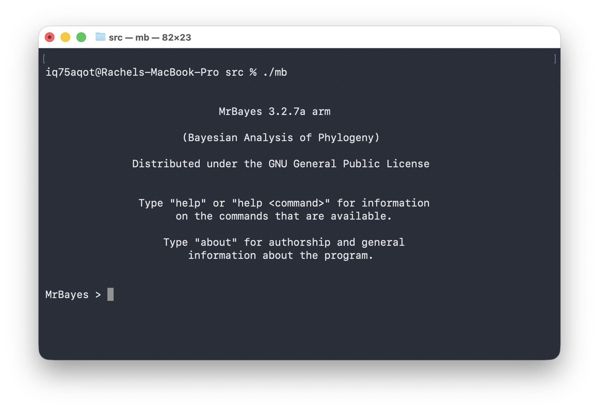
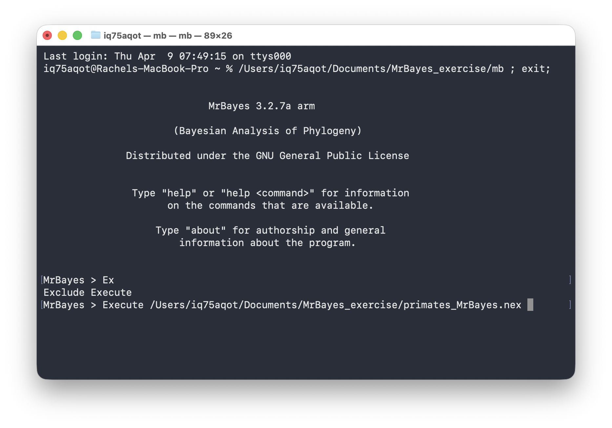
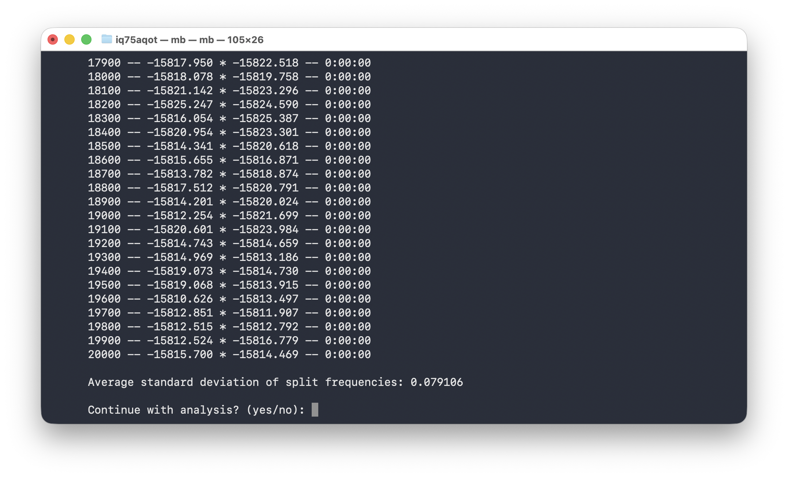
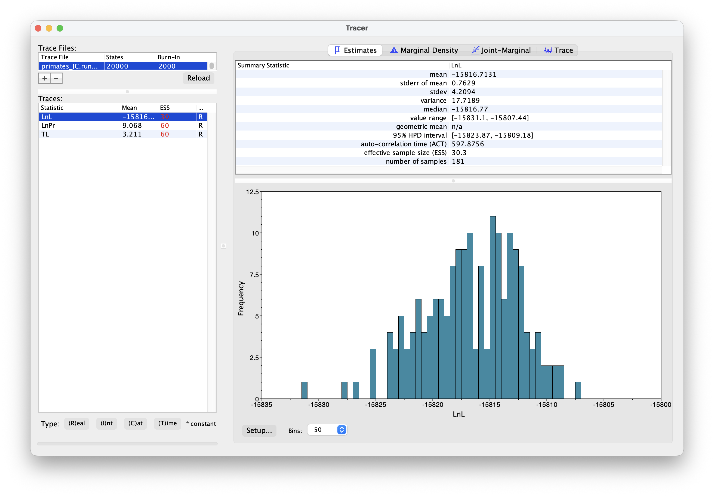
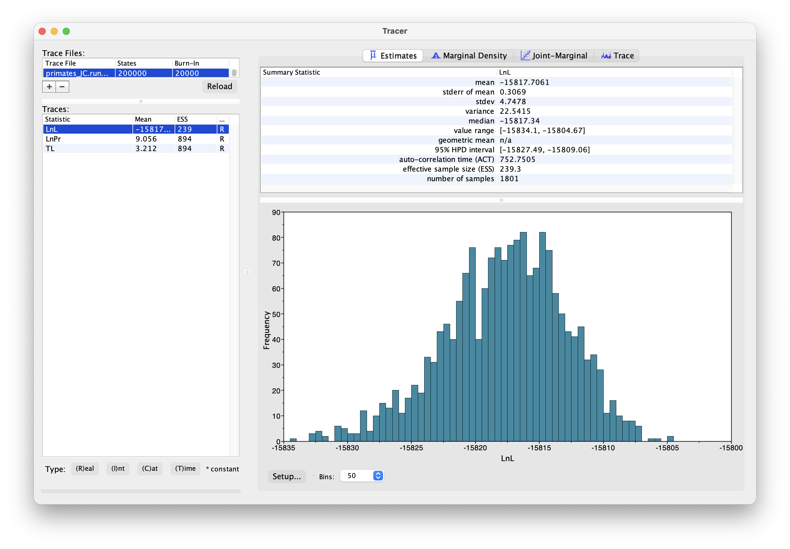
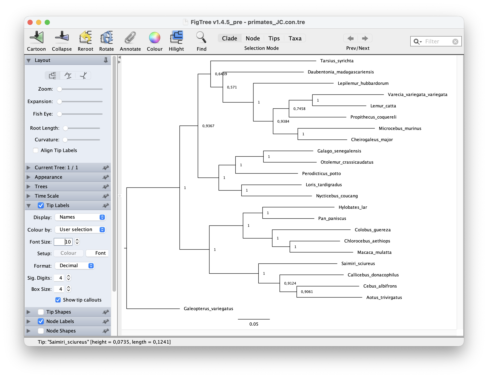
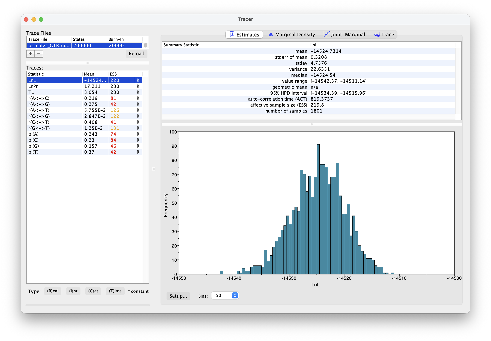

```{r setup, include=FALSE}
knitr::opts_chunk$set(echo = TRUE)
```

\

# Bayesian tree inference using MrBayes

This exercise provides a quick overview of tree building using the software MrBayes. We'll use a straightforward Bayesian approach with a standard set of substitutions models. 

We'll estimate of a tree of primates using a slightly longer alignment than the one we used before $-$ you can download this from [here](data/primates_and_galeopterus_cytb.nex). 

## Software

For this tutorial you'll need to download the software [MrBayes](https://nbisweden.github.io/MrBayes/download.html).

### Windows users 

You can simply download the pre-compiled version (MrBayes-3.2.7-WIN.zip). Click on the executable to open MrBayes. It should look like the figure below.

### Mac users

You will need to compile the software using the source code. First, download the source code and unzip the file. Open a terminal and `cd` to where ever you downloaded the file (probably your `Downloads` folder). Enter the commands below into your terminal. If this process is successful, an executable `mb` should appear in the `src` sub-directory. You can open MrBayes either by running the command `./mb` in a regular terminal window or you can click on the executable.
  
```{bash, eval=FALSE}
# compiling the software
cd MrBayes-3.2.7a
./configure
make
# running the software
cd src
./mb
```  

If everything is working it should look something like this.

```{r, echo=FALSE, out.width="65%",  out.extra='style="padding:10px"'}

```

To close the program you can simply enter the command `Quit`. 
Enter the command `help` to bring up the help pages.

### Other software

You'll also need to download the software [Tracer](http://beast.community/tracer) and [FigTree](https://github.com/rambaut/figtree/releases).

To edit your input file use a source code editor of your choice, e.g., [Visual Studio Code](https://code.visualstudio.com).

## How to organise your files

I recommend creating a folder for this exercise and placing your data file (`primates_and_galeopterus_cytb.nex`) and the MrBayes executable in here. All your output should also appear here.

## Setting up commands in MrBayes

You can enter commands directly into MrBayes, but an alternative approach is to specify all your commands in a block at the end of your nexus file. Open the nexus file in an editor of your choice.

The first thing we want to do is initiate the nexus block. Simply enter the following commands at the end of the file - these commands will initiate and terminate the MrBayes block and all other commands will go in between.

```{bash, eval=FALSE}
begin mrbayes;

[All your MrBayes commands will go here!]

end;
```

For setting up regular Bayesian tree inference we need to specify two model components: 

  1. we need a prior on the topology and branch lengths 
  2. and we need to specify a substitution model

## The tree prior

The following commands specify a uniform prior on the **tree topology**, meaning that all possible tree configurations have the *same probability* under the prior. Next we need to specify a prior on the **branch lengths**. We'll do this using an exponential distribution, with a mean of 0.1.

You'll notice that all commands require a semi-colon `;` at the end of the line.

```{bash tree, eval=FALSE}
prset topologypr = uniform;
prset brlenspr = unconstrained:exp(10.0);
```

The uniform tree prior is actually the default used in MrBayes, so you could technically omit the first line here and MrBayes would still use this prior.

## The Jukes-Cantor substitution model

In this first analysis we will use the Jukes-Cantor (JC) substitution model. Under this model there is a single substitution rate and base (state) frequencies are assumed to be equal. 

In MrBayes, the commands `lset` and `pset` are used to set up the substitution model.

```{bash JC, eval=FALSE}
lset nst = 1; [number of rate categories]
prset statefreqpr = fixed(equal);
```

By default MrBayes allows the evolutionary rate to vary across sites in our alignment (called among site rate variation). Often we do want to use this option but for now, just to keep things simple, we'll switch this off.

```{bash ASRV, eval=FALSE}
lset rates = equal; [assume rates are also constant across sites]
```

## Running MrBayes

Next let's open MrBayes and execute the above commands. Click on the `mb` executable. **Mac users** the easiest way to direct MrBayes to your file is to drag and drop your file into the MrBayes window. It should look something like this.

```{r, echo=FALSE, out.width="65%",  out.extra='style="padding:10px"'}

```

Next press enter!

**Windows users** - I'm not sure, let's work this out together.

To ensure your model is set up correctly you can use the `showmodel` - this prints out all the prior and parameter settings, including the default settings and the ones you modified. 

## MCMC settings

Before we run the analysis we just need to finish setting up the MCMC. Go back to the MrBayes block in your nexus file.

Next add the following commands. This command specifies the MCMC setting and initiates the run. Here we're using one chain, with 2000 generations, sampling every 100 iterations. By default the program runs two independent chain simultaneously. The `nchains` argument here specifies whether we want to use Metropolis coupled chains. Usually we do what to do this, as its more efficient, but we won't do this now (`nchains=1`)  

We also need to specify the full file path and output file name to ensure the output ends up in the right place.

```{r mcmc, eval=FALSE}
mcmc ngen = 2000 samplefreq = 100 printfreq = 100 nchains = 1 filename = /Users/iq75aqot/Documents/MrBayes_exercise/primates_JC;
```

Go back to the MrBayes window and execute the file as above. If everything is working, the MCMC should initiate. 
After 20000 iterations it will ask if you want to continue.

```{r, echo=FALSE, out.width="65%",  out.extra='style="padding:10px"'}

```

Type `no` and press enter. Leave the MrBayes window open for now.

## Evaluating the output

During the MCMC run, the program should have output the log `.p` and the trees `.t` files. Open these in a text editor. 

>What do you make of the contents of the log and tree files?

The first thing we want to check is **convergence**. We can do this using the program Tracer.
Open Tracer and drag and drop your `.p` file into the panel on the left or you can go to File > Import Trace File. What you see should look something like this.

```{r, echo=FALSE, out.width="65%",  out.extra='style="padding:10px"'}

```

Explore the output, including the Trace panel at the top.

>What do the histograms represent? Do you think our analysis has reached convergence?

There are some indicators that our analysis *hasn't* converged, including the ESS values which are highlighted in red, and the trace plots.
This means we haven't adequately approximated the posterior parameter space. 

Let's increase the chain length to 200000 and rerun the MCMC. This might take a bit longer $-$ while you're waiting for this to run, you could move on and set up the GTR substitution model. 

You're already getting a flavor for how long MCMC analyses can take. It's very common to have to run empirical analyses for millions+ generations and it can often take several days for a single analysis.

Once your longer run is complete, open the file again in Tracer. Your new output should look something like this.

```{r, echo=FALSE, out.width="85%",  out.extra='style="padding:10px"'}

```

> What differences do you notice in the output? 

Actually, if wanted to use this output for publication, we would still want to run the chain for longer and examine more convergence diagnostics.

## Summarising the output

Back in MrBayes we can also generate summary trees. We'll use the maximum a posteriori (MAP) tree $-$ this is the tree with the highest posterior probability. This is just one way of summarising the posterior distribution of trees. Simple type the command below into MrBayes.

It is important to keep in mind that the summary tree is not the "true" result $-$ the entire posterior distribution (which might contain multiple trees) is the full result. 

```{r MAP, eval=FALSE}
# generate a MAP tree
sumt;
```

You can also include this command in your nexus file. This will output a tree file that ends with `.con.tre`.

You can open this tree in the program FigTree. To root the tree, select the branch leading to `"Galeopterus_variegatus` $-$ this is our outgroup, the flying lemur $-$ and click "Reroot". 
Next let's look at the node support. Go to Node Labels > Display > prop.
Your output should look something like this.

```{r, echo=FALSE, out.width="85%",  out.extra='style="padding:10px"'}

```

## The GTR substitution model {#GTR}

Next let's set up an analysis using the General Time Reversible (GTR) model. Under this model both rates of change between states and state frequencies are allowed to vary.  

Copy and paste your nexus file, and call it something like `primates-GTR.nex`. Alternatively, you can comment out the commands for the JC model and use the same file - it's up to you, just be careful not to overwrite your existing output files.

Enter the following commands to set up the GTR model. For the state frequencies we're using a Dirichlet prior, which is a useful distribution for proportions. 

```{r Q2, eval=FALSE}
lset nst = 6; [number of rate categories]
prset statefreqpr = Dirichlet(1.0,1.0,1.0,1.0);
```

The rest of the set up is the same as before.

Change the name of your output files (so they don't overwrite the existing files) and rerun your analysis using the GTR model. 

```{r mcmc2, eval=FALSE}
mcmc ngen = 2000 samplefreq = 100 printfreq = 100 nchains = 1 filename = /Users/iq75aqot/Documents/MrBayes_exercise/primates_GTR;
```

Run the analysis using MrBayes as above. 

Once your analysis is done, you can examine the log files in Tracer. The output should look something like this.

```{r, echo=FALSE, out.width="85%",  out.extra='style="padding:10px"'}

```

>What differences do you notice between the runs? Are there any additional parameters? Are there any differences between equivalent parameters? 

Generate a new MAP tree and then compare them.

> Are there any differences between the summary trees?  

> How does your tree compare to a [published phylogeny](https://www.science.org/doi/epdf/10.1126/science.abn6919) of primates?

## Other resources for buidling trees using Bayesian inference

MrBayes can be used to set up much more complex models than the ones in this tutorial, for both unconstrained (undated) and dated tree inference. Although its less flexible than some alternative options, including [RevBayes](https://revbayes.github.io/) and [BEAST2](https://www.beast2.org/), it was well designed, is relatively straightforward to use, and remains very popular for Bayesian tree inference. You can learn more about the options in the program [manual](https://gensoft.pasteur.fr/docs/mrbayes/3.2.7/Manual_MrBayes_v3.2.pdf) or in various comprehsive tutorials like [this one](https://www.math.auckland.ac.nz/~nicholls/BIOSCI743/mrbayes%20overview.pdf). 

A complete script for this exercise can be downloaded  [here](scripts/primates_MrBayes.nex).
