```{r setup, include=FALSE}
knitr::opts_chunk$set(echo = TRUE)
```

\

# BDMM-Prime for Macroevolution

This tutorial assumes that you have already gained some experience using BEAST2. If you have not already done so, we recommend first completing the following tutorials: 

- [Introduction to BEAST2](https://taming-the-beast.org/tutorials/Introduction-to-BEAST2/)
- [Dating Species Divergences with the Fossilized Birth-Death Process](https://taming-the-beast.org/tutorials/FBD-tutorial/)

## Background

BDMM-Prime is a package written for flexible phylodynamic inference. It combines the functionality of multiple other packages, including the BDSKY and SA packages, and can be applied to a wide range of scenarios in epidemiology and macroevolution. Due to the flexibility and the large variety of ways in which model parameters can be combined using BDMM-Prime, there's more options to consider when setting up your analysis.

```{r hidden_notes, eval=FALSE, echo=FALSE}
## In addition to standard phylodynamic inference, i.e., inferring time trees and rates associated with the underlying phylodynamic model, BDMM-Prime can output a file that allows you to infer population size trajectories.
## More information is available via the [BDMM-Prime package website](https://tgvaughan.github.io/BDMM-Prime/#id-1-Introduction).
## In this tutorial, we'll explore whether there is evidence that rates of diversification or sampling vary across these three regions.
##For alternative options see... XXX
##[Note to other editors: based on my experience trying to help others use BDMM-Prime this part is quite overwhelming people the most and often leads to errors in their set up]
```

This tutorial walks through an example of how the package can be applied in macroevolution. 

## The data

In this tutorial we'll use a published dataset of [aminotes](https://en.wikipedia.org/wiki/Amniote) that has been used previously to explore the early evolution of this group. 

The data comprises 294 characters for 70 fossils, as well as their age and locality information, spanning ~70 myr from the late Carboniferous to the mid Triassic. The specimens can be categorised into three broad geographic areas associated with the supercontinent [Pangea](https://en.wikipedia.org/wiki/Pangaea). These correspond approximately to what would be known today as Eurasia, North America, and South Africa.

## Installing the BDMM-Prime package

The first thing we need to do is install the BDMM-Prime package. This package is not yet listed in the Package Manager in BEAUTi, so we need to install it using the package URL. 

1. Open BEAUTi and go to File > Manage Packages. 
2. Select 'Package repositories' at the bottom of this window. This will open the 'Package Repository Manager'. 
3. At the bottom click 'Add URL' and enter the following address: https://tgvaughan.github.io/BDMM-Prime/package.xml 
It should look like this:

```{r, echo=FALSE, out.width="70%",  out.extra='style="padding:5px"'}
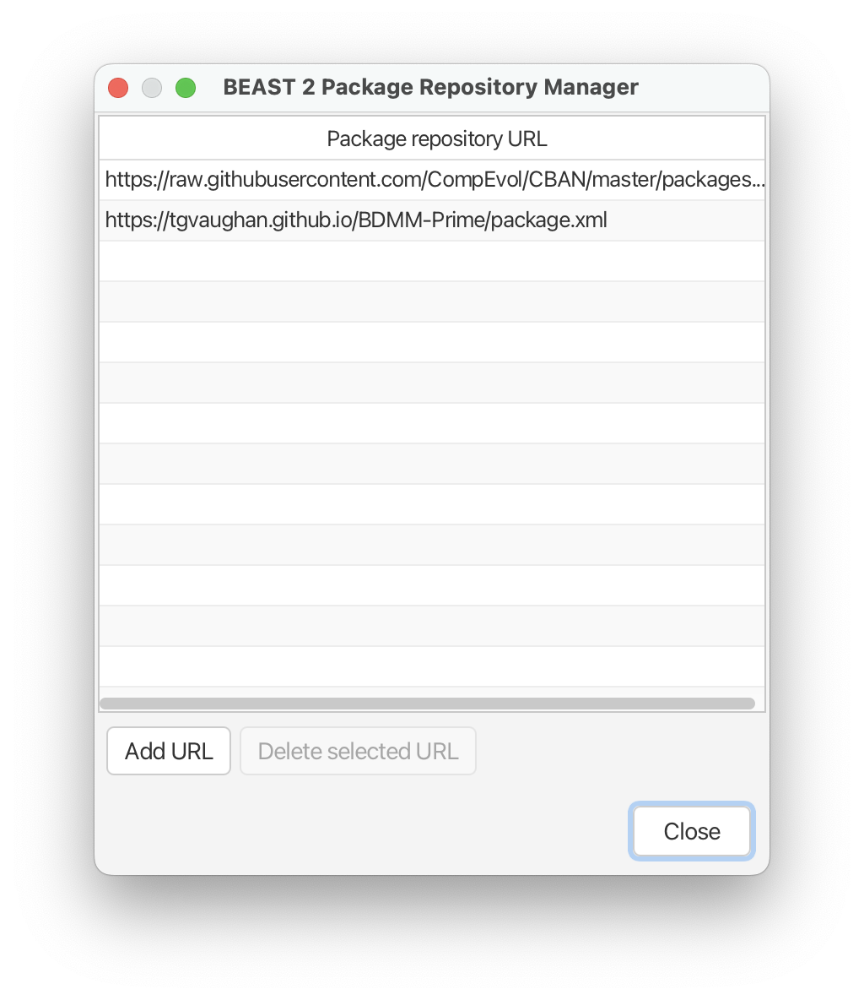
```

4. Click 'OK'. The BDMM-Prime package should now appear in your list of installed packages. [Could be clearer when to click ok vs. close.]
5. Select the BDMM-Prime package and click 'Install/Upgrade' at the bottom of the window. This ensures you have the latest version installed.

```{r, echo=FALSE, out.width="80%",  out.extra='style="padding:5px"'}
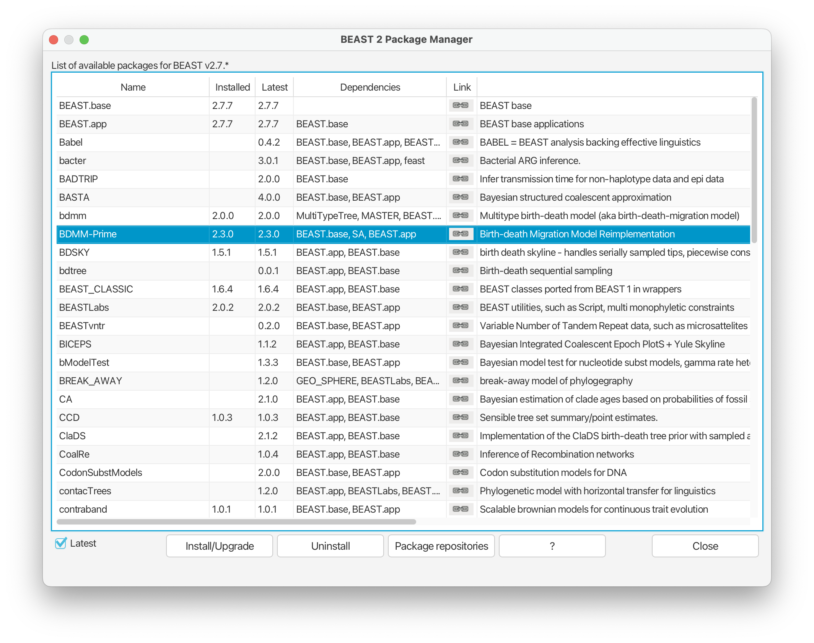
```

If you haven't done so already, you will also need to **install the MM package** for models of morphological evolution to complete this tutorial. This package also appears on the same list in the Package Manager.

**Restart BEAUTi to set up an analysis using BDMM-Prime.**

## The Partitions panel

Download the [nexus file](data/amniotes.nex) associated with this tutorial. To input your data into BEAUTi, download the nexus file and either drag and drop the file into the Partitions panel and select 'Add Morphological Data' or go to File > 'Add Morphological Data'.

```{r, echo=FALSE, out.width="40%",  out.extra='style="padding:5px"'}
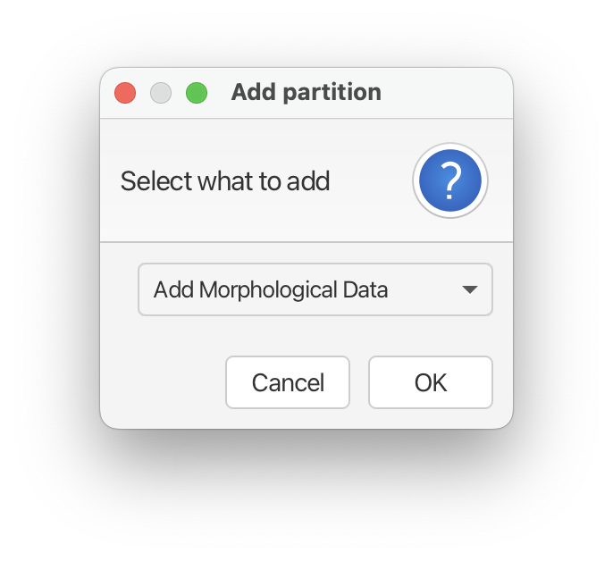
```

This will bring up a window that asks, "Would you like to condition of recording variable characters only (Mkv)? Click 'Yes'. Since we typically don't collect non-variable morphological characters this option makes sense for our dataset.

```{r, echo=FALSE, out.width="50%",  out.extra='style="padding:5px"'}
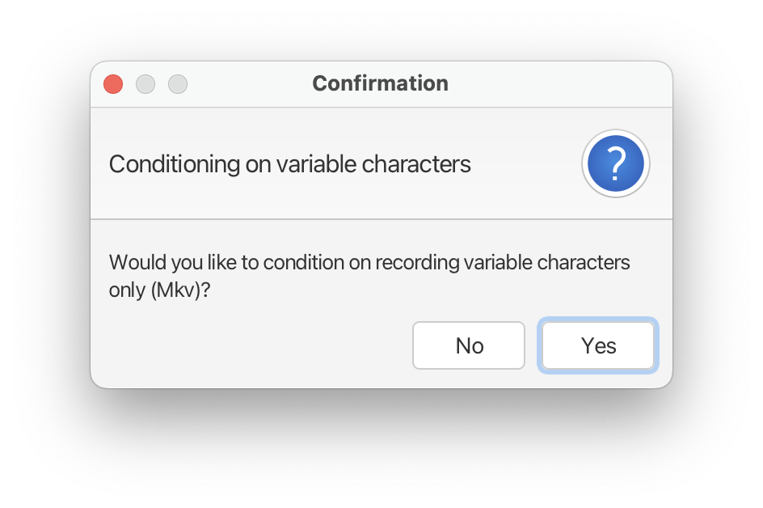
```

Your BEAUTi window should now look like this:

```{r, echo=FALSE, out.width="80%",  out.extra='style="padding:5px"'}
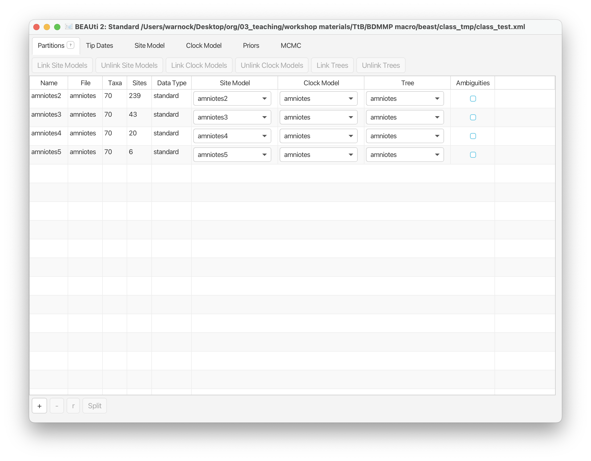
```

By default characters are separated into four partitions. This means that characters will be assigned to a substitution rate matrix where the number of possible states corresponds to the maximum observed state for each character. 

Note that the Site Model is *unlinked* across partitions, while the Clock and Tree models are *linked* by default. This means that we will allow each partition to evolve under an separate substitution process, but we will assume that the underlying tree is the same and that the same clock model is shared across partitions. 

## The Tip Dates panel

Navigate to the Tip Dates panel and select 'Use tip dates'. Here we can extract information about the age of our samples from the tip labels. For our analysis, the time units are in millions of years, so we'll leave 'year' selected in the first drop down menu. From the second drop down menu change 'Since some time in the past' to 'Before the present'. 

Next select 'Auto-configure'. Leave 'use everything' selected and from the drop down menu select 'after last', leaving the delimiter as "_". This will extract age information from the end of your taxon labels. 

```{r, echo=FALSE, out.width="70%",  out.extra='style="padding:5px"'}
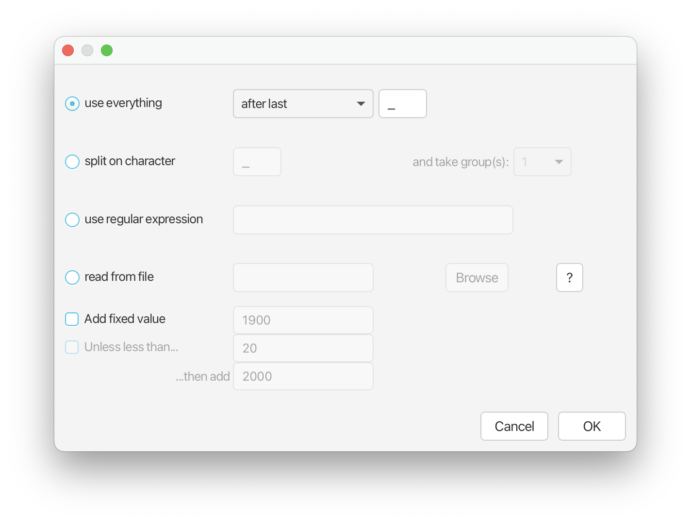
```

Note that although our samples span an interval in the past, internally BEAST rescales the tree such the youngest sample in the tree is at t = 0. The rescaled values are shown under the column Age/Height. 

To make sure everything is set up correctly, if you scroll down, the youngest fossil, 'Candelaria_barbouri_NAm_239.5', should have a "0.0" next to it under the Age/Height column.

```{r, echo=FALSE, out.width="80%",  out.extra='style="padding:5px"'}
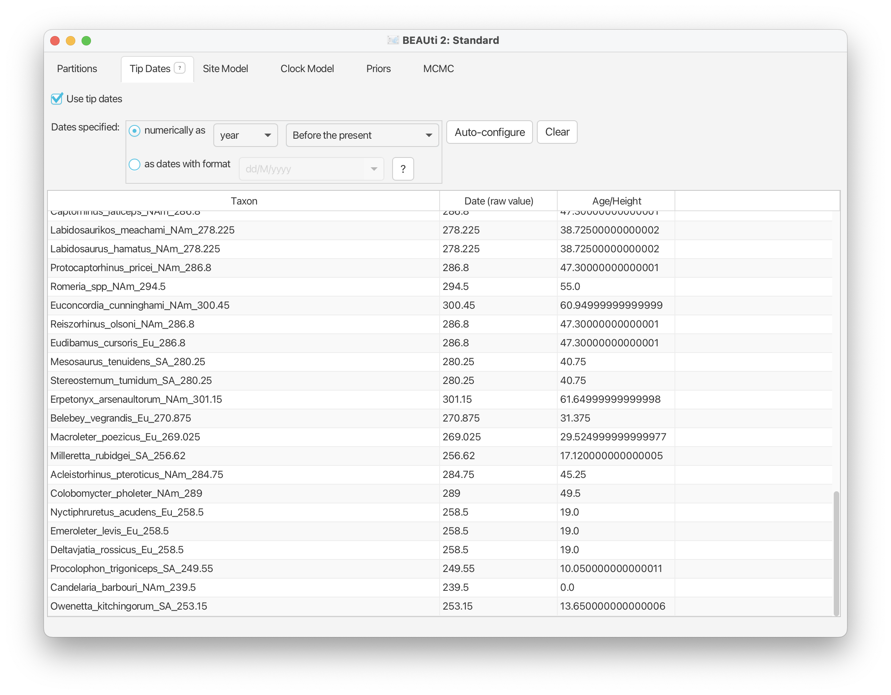
```

## The Site Model panel

Under the Site Model panel we can specify the model of morphological evolution. For this exercise we'll use the simple Mk Lewis model for each of our partitions and leave everything as it is.

```{r, echo=FALSE, out.width="80%",  out.extra='style="padding:5px"'}
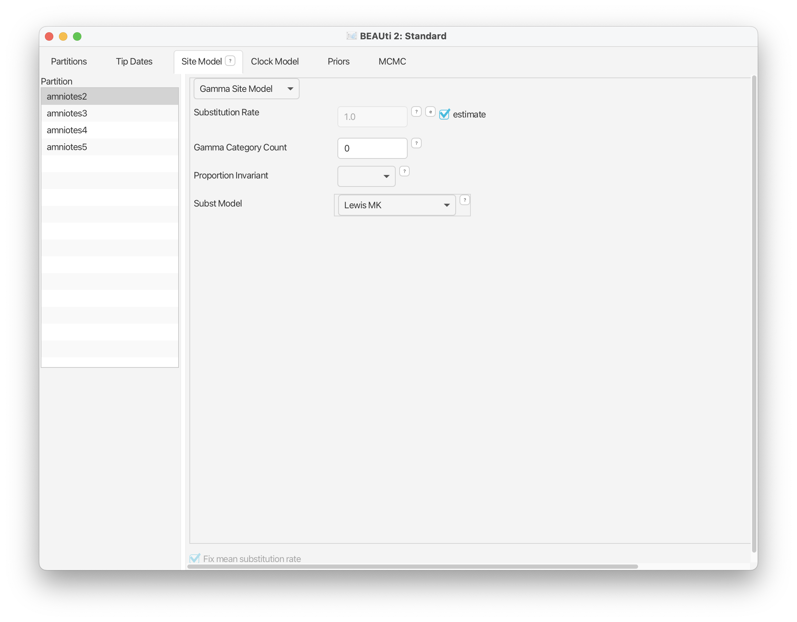
```

## The Clock Model panel
  
Navigate to the Clock Model panel and select 'Relaxed Clock Log Normal' from the drop down menu. This will allow rates of evolution to vary across branches in the our tree.

```{r, echo=FALSE, out.width="80%",  out.extra='style="padding:5px"'}
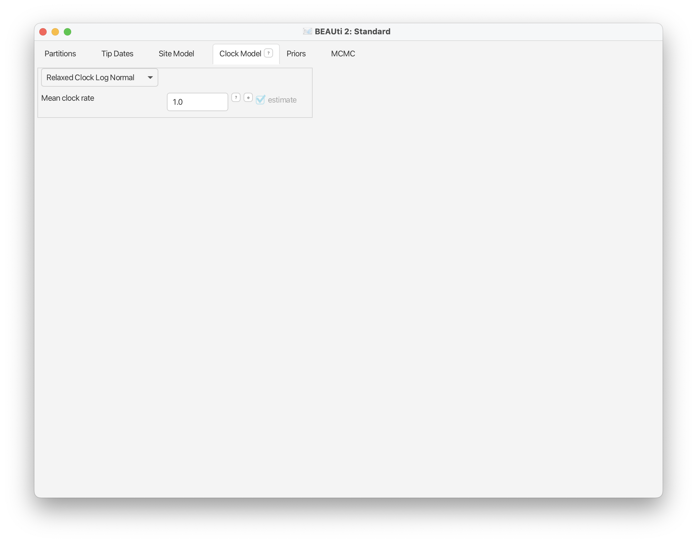
```

## The Priors panel

Here we will set up all the tree model and all the prior parameters associated with our analysis.

### Clock model parameters

Let's start with clock model parameters, 'ucldMean' and 'ucldStdev', which you should already see listed here.

For the mean on the overall clock rate we will use a normal prior, following the original study, with a mean of 0.001 and a variance of 0.01. Note that rates cannot be negative so the distribution is truncated at zero. Finally, select the 'initial' value option next to the distribution and change 'Value' to 0.001. This ensures our analysis starts in a reasonable part of the parameter space. Click 'OK'.

```{r, echo=FALSE, out.width="80%",  out.extra='style="padding:5px"'}
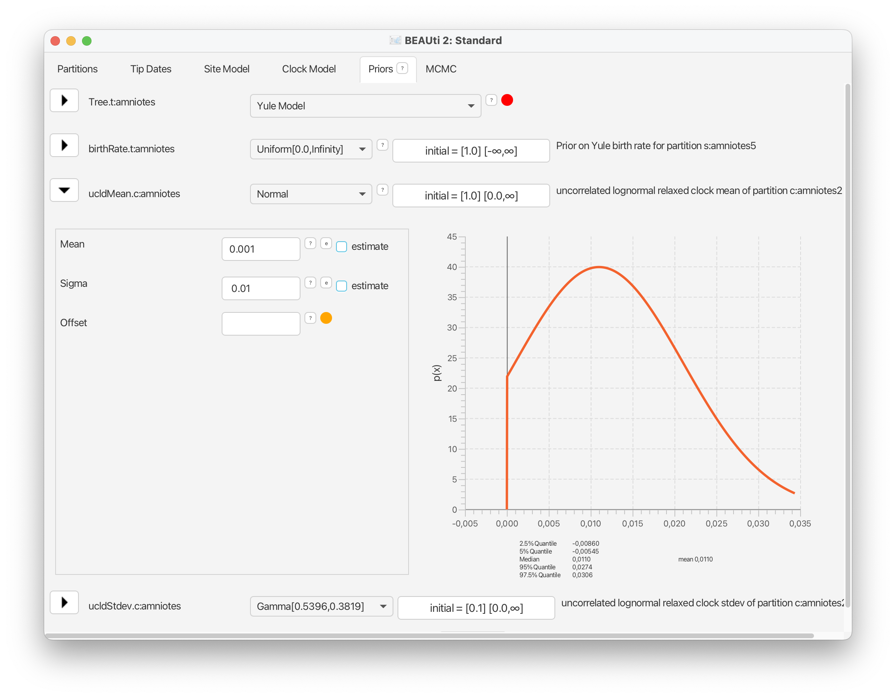
```

```{r, echo=FALSE, out.width="80%",  out.extra='style="padding:5px"'}
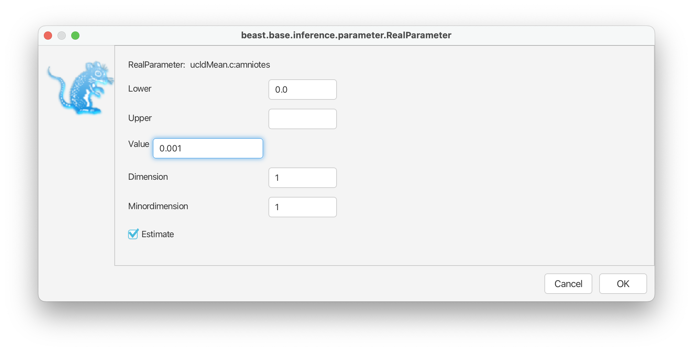
```

For the standard deviation of the distribution of clock rates, we'll use an exponential prior with a mean of 0.1. 

```{r, echo=FALSE, out.width="80%",  out.extra='style="padding:5px"'}
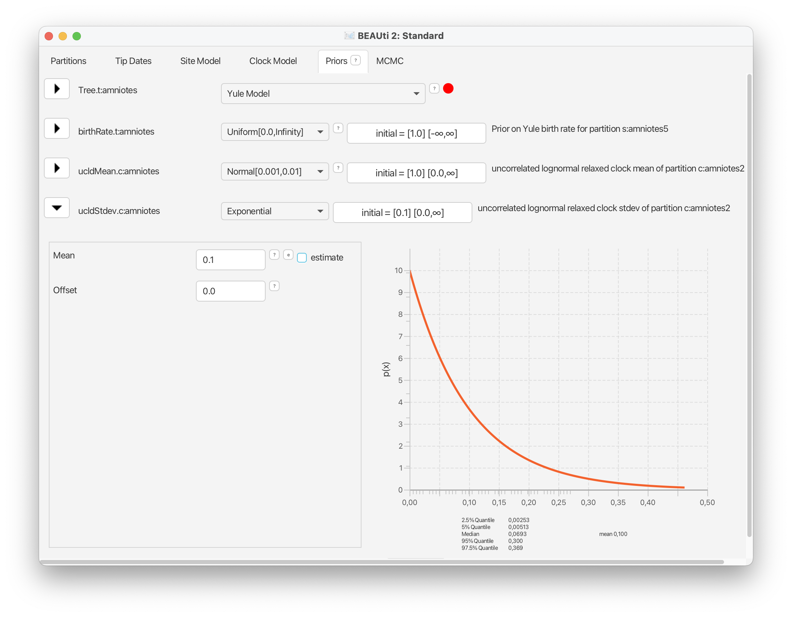
```

These prior choices match our expectations about rates of morphological evolution estimated in previous analyses of vertebrates, i.e., the rates tend to be relatively low. 

### BDMM-Prime

Next let's set up the phylodynamic model. Select 'BDMMPrime' from drop down menu at the top of the Priors panel. 

There are a lot of options for combining parameters using BDMM-Prime, so we need to be careful to select parameter combinations that make sense for our dataset.
 
There are three options for parameterising the birth-death model using BDMM-Prime. 

For macroevolution we can choose from two options:

- The "Canonical Parameterization", which is parameterises the model using the birth, death, and sampling rates
- The "Fossilized Birth Death Parameterization" which is parameterized using diversifcation rate, turnover rate, and Sampling Proportion

The relationship between these parameters is shown in Table 1. Both are useful in macroevolution and your choice might depend on which parameters are of most interest to you or what prior information you have available. Note that after your analysis is complete, you can always go from one set of parameters to the other via the transformations shown in the table.

In this tutorial we'll use the "Canonical Parameterization", which you can select from the drop down menu next to Parameterization. This option can be applied to a wide range of scenarios in both epidemiology and macroevolution. 

Later we will assign taxa to types based on their geographic provinance but for the first analysis in this tutorial we'll assume that birth, death, and sampling are all constant through time and across our tree. Thus we'll leave "Number of change times" for each of these parameters as 0 (but see below). The only change we'll make is to change the value listed next to Birth Rate and Death Rate in Epoch 1 from 1.0 to 0.1 - these are the starting values for these parameters. Click on each value to edit it and press enter. Notice that 'Estimate values' is checked for all three of these parameters, which means these parameters will be estimated and not fixed during inference.  

```{r, echo=FALSE, out.width="80%",  out.extra='style="padding:5px"'}
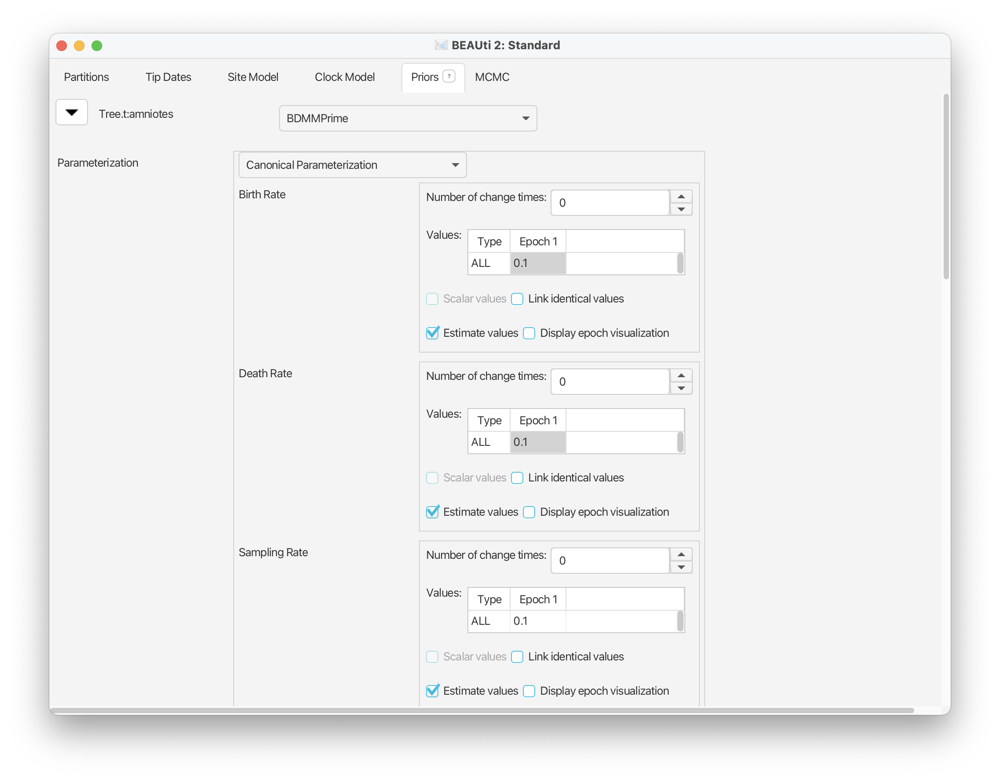
```

Scroll down to the next set of parameters of interest. Rho Sampling is the probability of sampling a lineage at a given time. In macroevolution this is usually associated with the extant sampling probability at t = 0. In our case study, we have no sampling beyond the period of interest, i.e., the youngest sample included in our dataset is from the Triassic. There are many amniotes that persisted beyond this interval until the present but these are not included in our dataset. This means we have no rho-sampled taxa and it makes sense to leave Rho = 0.0.

The next parameter of note is the Removal Prob - this is the probability that a lineage is removed from the population upon sampling and makes more sense in an epidemiological context. We need to change this to 0.0. Select the valued listed next to Epoch 1 and change it to 0.0.

```{r, echo=FALSE, out.width="80%",  out.extra='style="padding:5px"'}
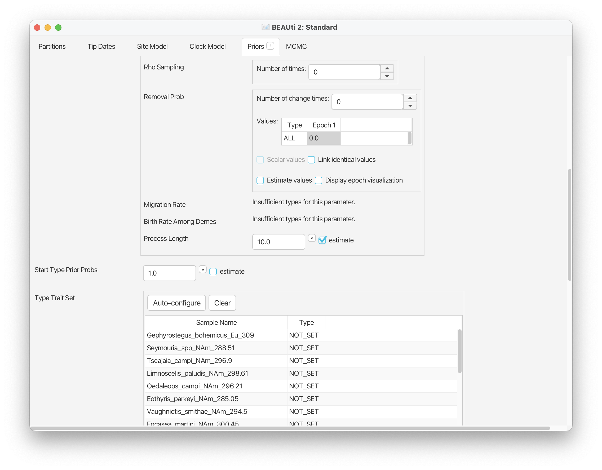
```

For now you can leave everything else under this tab as it is. If you close this tab and scroll down you should now be able to see an additional set of parameters listed in the Priors panel for the birth, death, sampling rates and the origin time parameter.

For the birth, death, and sampling rate parameters we'll use an exponential prior with a mean = 0.1. This matches values that are typically estimated for these parameters in paleobiology.

From the drop down menu next to birthRateCanonical select 'Exponential' and expand this selection. Change the mean of this distribution to 0.1.

```{r, echo=FALSE, out.width="80%",  out.extra='style="padding:5px"'}
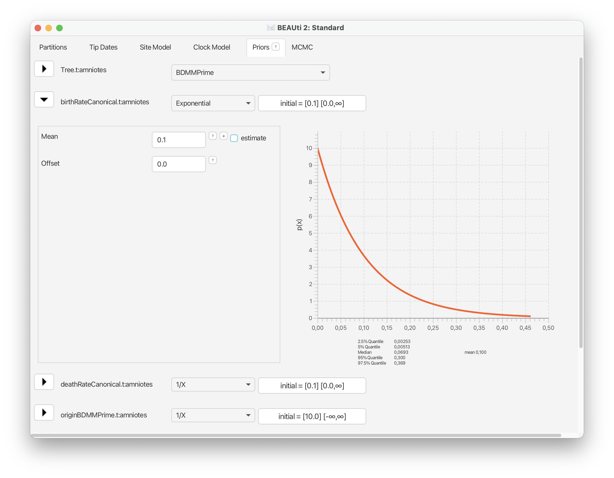
```

Go ahead and do the same for the death and sampling rate parameters.

```{r, echo=FALSE, out.width="80%",  out.extra='style="padding:5px"'}
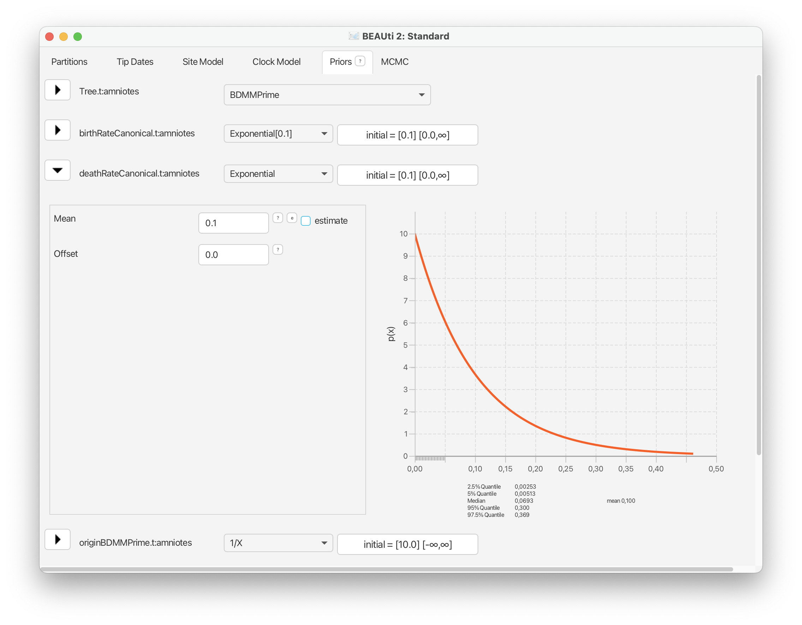
```

```{r, echo=FALSE, out.width="80%",  out.extra='style="padding:5px"'}
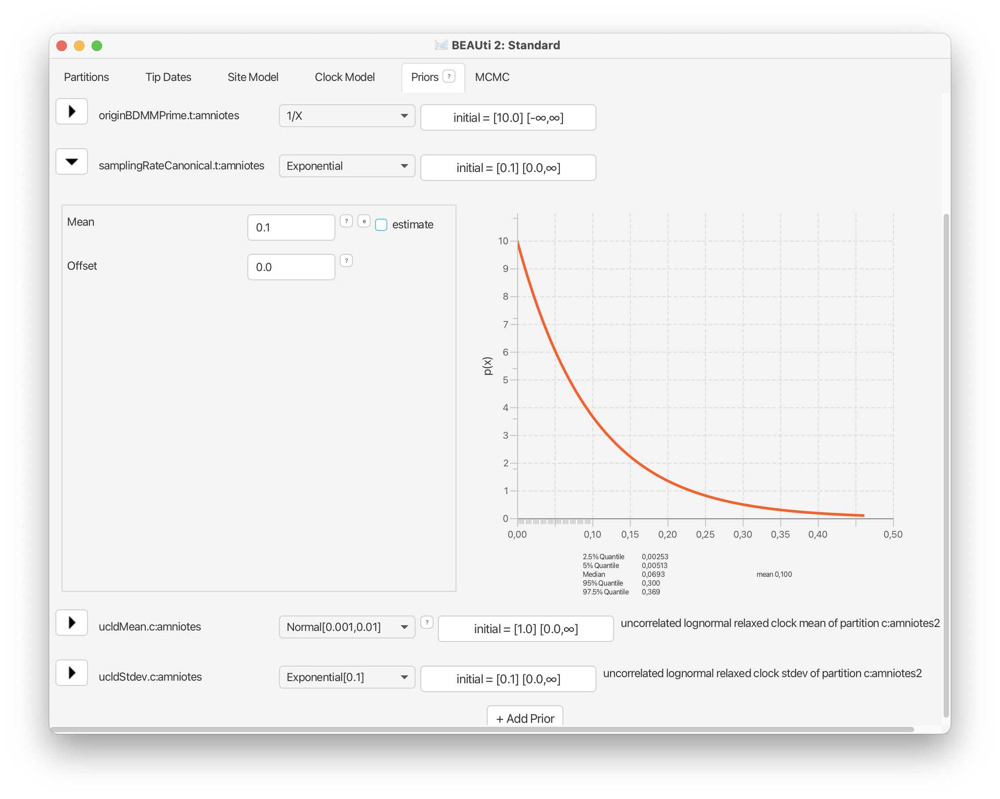
```

For the origin time parameter, we'll also use an exponential distribution following the original study, with an offset = 318.1 Ma and a mean = 327.5 Ma.
However, recall that BEAST scales the tree such the youngest sample is always zero, so these values need to be defined relative to t = 0. Select 'Exponential' from the drop down menu next to originBDMMPrime and expand this selection. Change the offset to 81.1, which is 318.1 minus the youngest time of our sampling interval = 237, and change the mean to 10.0. Finally, select the 'initial' value box and change 'Value' to 100.0. Click 'OK'.

```{r, echo=FALSE, out.width="80%",  out.extra='style="padding:5px"'}
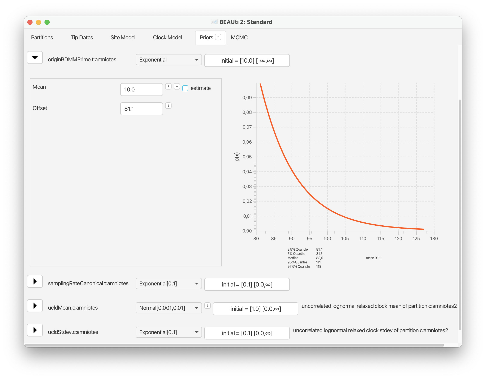
```

```{r, echo=FALSE, out.width="80%",  out.extra='style="padding:5px"'}

```

### Adding taxonomic constraints

We're going to use two taxonomic constraints for this analysis. Srcoll down to the bottom of the Priors panel and click '+Add Prior'. From the drop down menu select MRCA prior. Click 'OK'. This will open a box where you can define groups of taxa. 

For the first constraint, type 'ingroup1' into the box next to 'Taxon set label'. From the list of taxa on the left click on any taxa and use select all (e.g., cmd + A) to highlight all of them. Scroll down to 'Gephyrostegus bohemicus' and deselect this taxon using cmd + shift. Click the '>>' button. Now all taxa except Gephyrostegus should appear on the right. Alternatively, you can select all of them, move them to the right and simply move Gephyrostegus back to the left using the '<<' button. 

```{r, echo=FALSE, out.width="50%",  out.extra='style="padding:5px"'}
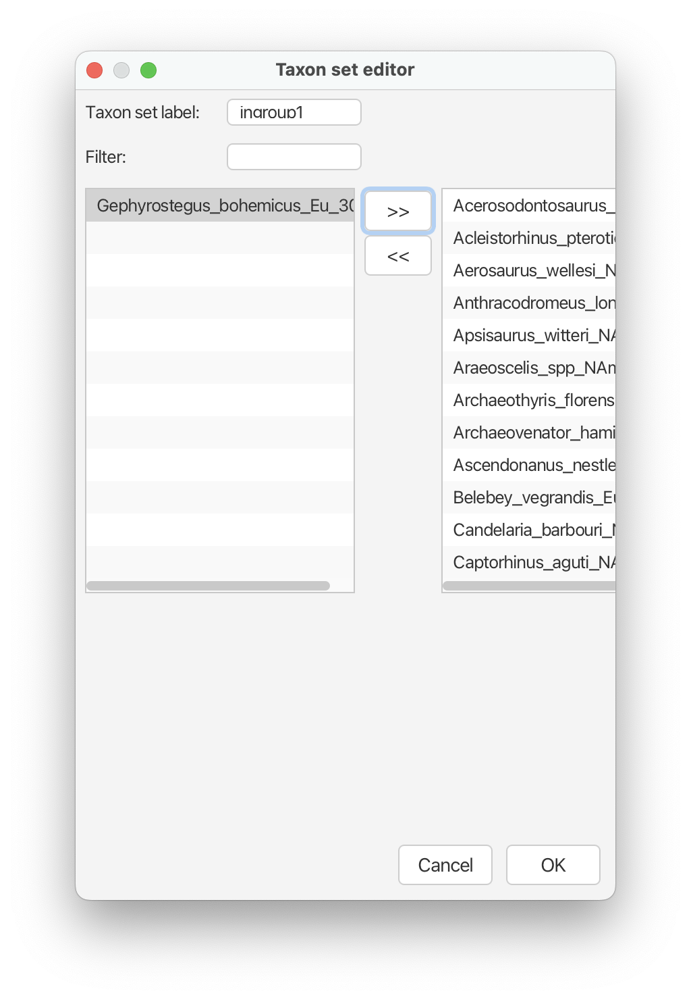
```

Click OK and then select the checkbox that says 'monophyletic' that appear next to this constraint.

To add the next constraint, click '+Add Prior'. From the drop down menu select MRCA prior. Click 'OK'. 

For the first constraint, type 'ingroup2' into the box next to 'Taxon set label'. This next constraint will include all taxa excluding 'Gephyrostegus bohemicus' and 'Seymouria_spp'.

```{r, echo=FALSE, out.width="50%",  out.extra='style="padding:5px"'}
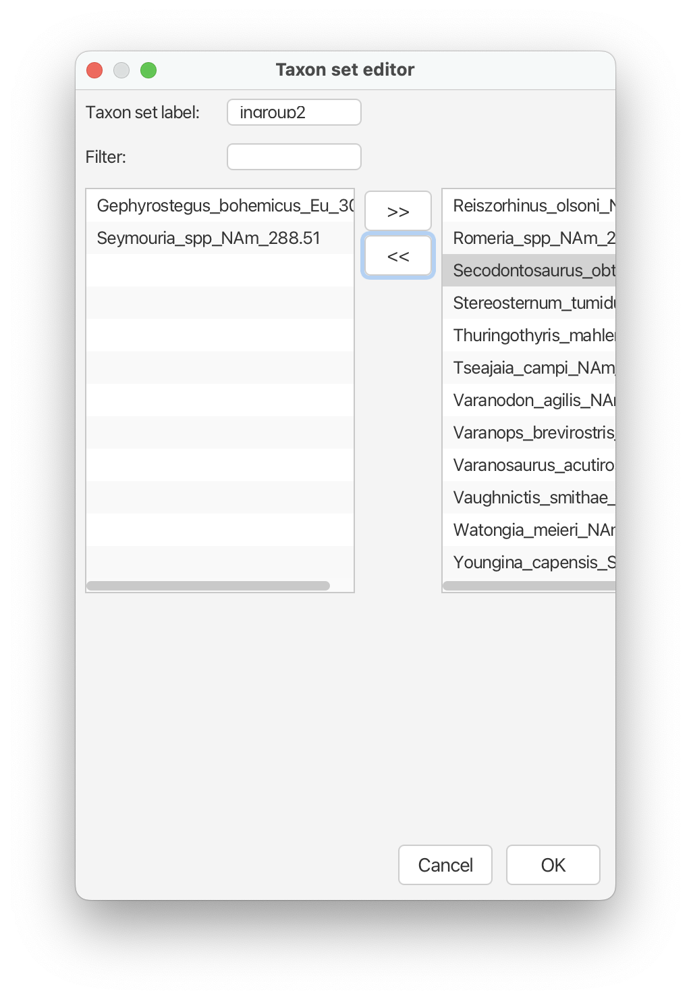
```
Click OK and then select the checkbox that says 'monophyletic' that appear next to this constraint.

```{r, echo=FALSE, out.width="80%",  out.extra='style="padding:5px"'}
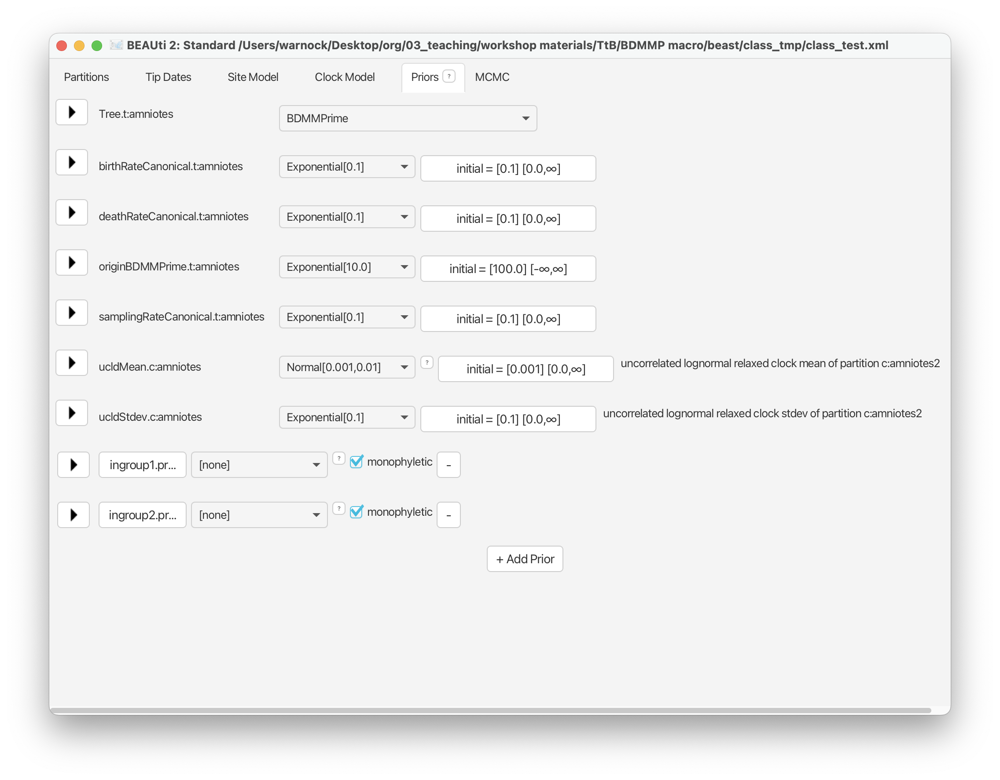
```

## The MCMC panel

Finally, navigate to the MCMC panel. For now, we'll leave the MCMC settings as the defaults. 

```{r, echo=FALSE, out.width="80%",  out.extra='style="padding:5px"'}
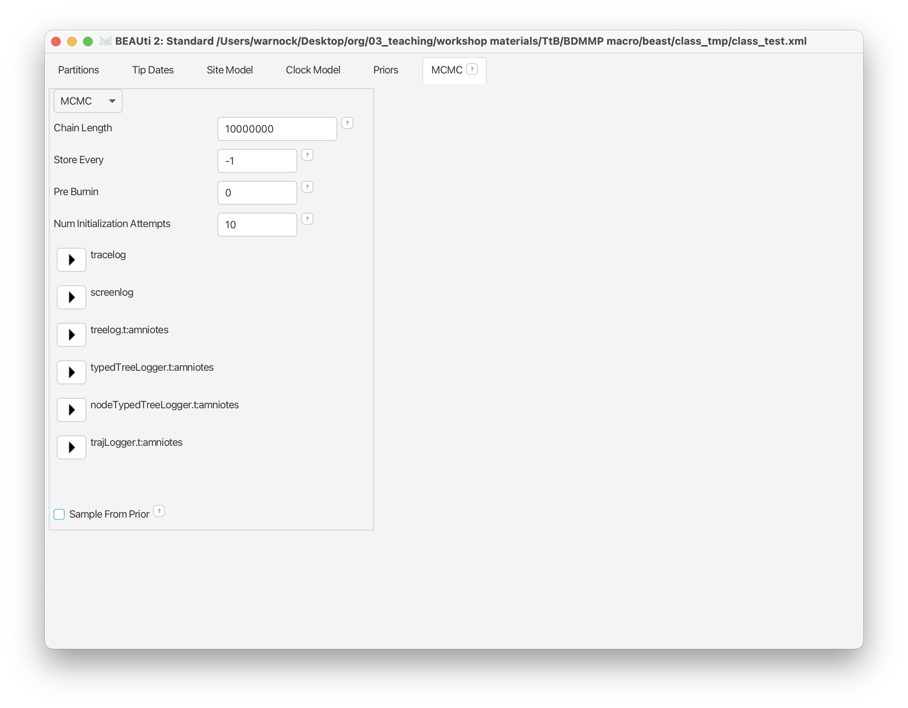
```

Go to File > Save as to save your xml input file. Call it something like 'amniotes_constant_rates_FBD.xml' or something.

## Running BEAST

To run your analysis open the BEAST application and navigate to the right working directory. Select your xml file and click Run. 

This analysis should take ~10-15 minutes to run. 

## Examining the output

First open the .log file in Tracer and explore the output. It should look something like this. 

```{r, echo=FALSE, out.width="70%",  out.extra='style="padding:5px"'}
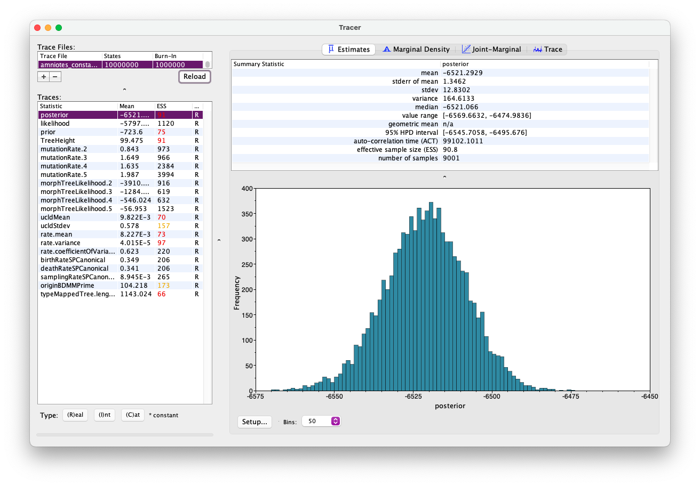
```

> Has your analysis converged?

Next let's generate a consensus tree. Open the TreeAnnotator application. For the 'Target tree type' we'll stick with the default 'Maximum clade credibility tree'. For the 'Node Heights' select 'Median heights' from the drop down menu.

For the Input Tree File: Choose file... navigate to your working directory and select the .trees file. For the Output File: Choose file... enter the name of your consensus tree file, something like 'amniotes.con.tre'.

```{r, echo=FALSE, out.width="50%",  out.extra='style="padding:5px"'}
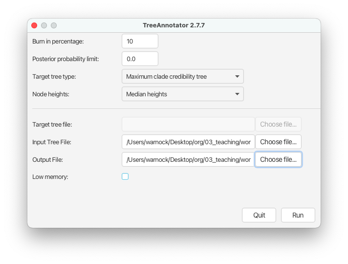
```

Finally, click 'Run'. You can then open the consensus tree in FigTree or IcyTree.

> Can you spot any differences with the [published topology](https://www.nature.com/articles/s41559-019-1047-3)


In this analysis we treated the fossil ages as fixed - this is not good practice and the tree topology we infer without accounting for fossil age uncertainty is actually a bit weird. For example, the analysis does not recover Reptilia or Synapsida as monophyletic. The more conventionally accepted topology is recovered once we take this into account. An xml file is provided for the same analysis including age uncertainty. This analysis takes longer to run, so the pre-cooked output for this analysis has also been [provided](BDMM-precooked.zip). 

